# ConvectTherm — 对流传热相变数值模拟

## 项目概述

本项目针对 **含相变的非稳态对流-扩散传热问题**，采用有限体积法（FVM）编制数值求解程序。

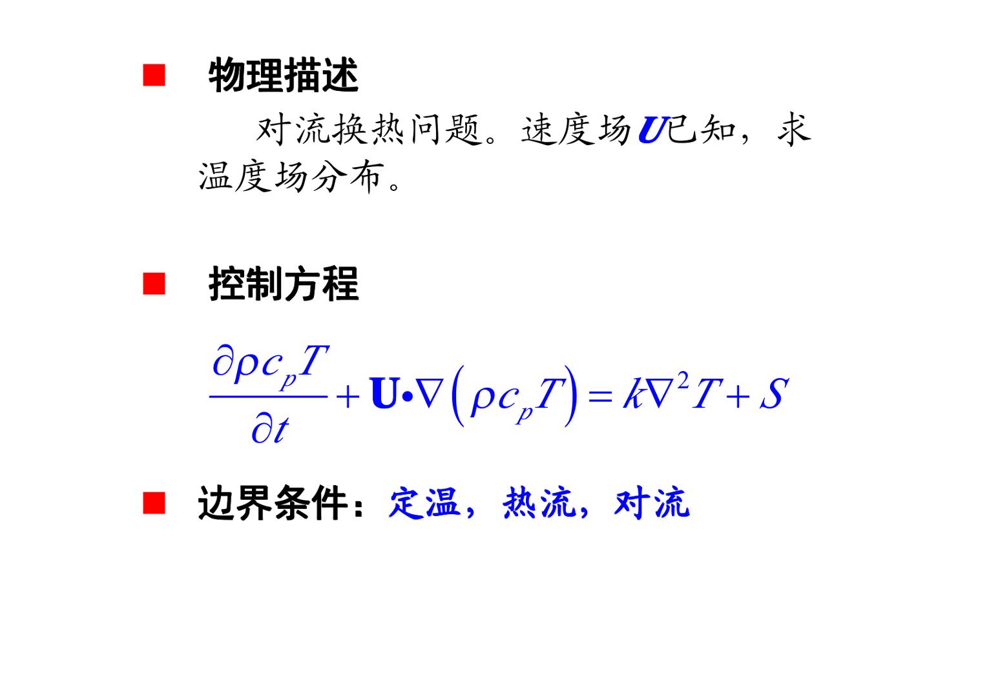

**物理场景**：矩形域内装水，水中含矩形冰块，通过不同边界条件加热，求解瞬态温度场分布，分析冰块融化过程。


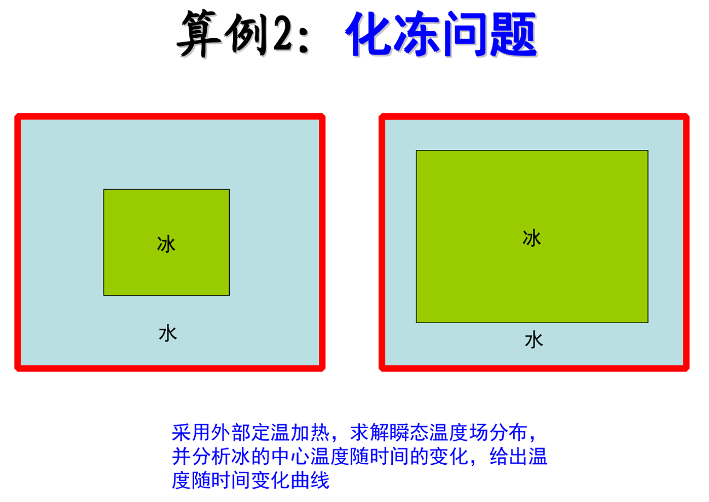

## 公式推导

### 1. 控制方程

含相变的对流-扩散传热统一形式：


其中  为体积热容， 为表观热容（含相变潜热）， 为液相速度场。

### 2. 表观热容法处理相变

在熔点  两侧引入相变区间 ，避免显式追踪冰-水界面：


**液相率** 在区间内线性插值：


**表观比热容** 在相变区间内叠加潜热项：


**物性插值**：，

### 3. 有限体积法离散

对控制方程在控制体  上积分，时间项全隐式，对流项一阶迎风，扩散项中心差分：


整理为标准代数方程：


其中 ，，，。

界面导热系数采用调和平均：

### 4. 边界条件

| 类型 | a_P 修正 | b 修正 |
|------|----------|--------|
| 定温 (Dirichlet) |  |  |
| 热流 (Neumann) | 不变 |  |
| 对流 (Robin) |  |  |

其中 。定温边界是  的极限。

### 5. 非线性求解

由于 、、 均随温度变化，每一时间步需 Picard 迭代 + 欠松弛：

1. 取 
2. 根据当前温度更新液相率及物性
3. 组装系数矩阵，TDMA（1D）/ 逐线 TDMA+SOR（2D）求解
4. 温度和物性欠松弛：
5. 检验收敛：

---

## 数值格式

| 项目 | 方案 | 说明 |
|------|------|------|
| 空间离散 | 有限体积法（FVM） | 守恒性好，适合不均匀物性 |
| 时间推进 | 全隐式（一阶） | 无条件稳定，适合相变问题 |
| 对流项 | 一阶迎风 | 稳定，可升级为 QUICK |
| 扩散项 | 中心差分 | 二阶精度 |
| 界面导热系数 | 调和平均 | 保证冰-水界面热流连续 |
| 相变处理 | 表观热容法 | 无需追踪相界面 |
| 线性求解 | TDMA (1D) / 逐线 TDMA+SOR (2D) | |
| 非线性处理 | Picard 迭代 + 欠松弛 | 抑制相变区震荡 |

---

## 模块结构

```
ConvectTherm/
├── main.py            主程序：6 个算例 + 可视化 + 数据存储
├── solver/
│   ├── constants.py   物理常数：水/冰物性，相变参数
│   ├── physics.py     相变模型：液相率、表观热容、物性插值
│   ├── tdma.py        TDMA 三对角求解器
│   ├── solver_1d.py   一维隐式 FVM 求解器
│   ├── solver_2d.py   二维隐式 FVM 求解器
│   └── visualize.py   可视化 + 数据存储
└── output/            输出目录（图片 + .npz 数据）
```

---

## 算例设计

### 物理场景

- 计算域：10 cm × 10 cm 矩形
- 冰块：位于域中央 3–7 cm，初始 4 cm × 4 cm
- 初始温度：冰块 268.15 K (−5°C)，外围水 275.15 K (2°C)
- 物理时间：1 小时
- 纯导热（无对流），

### 算例矩阵

| Case | 维度 | 左/右边界 | 上/下边界 | 物理意义 |
|------|------|-----------|-----------|----------|
| 1 | 1D | 定温 293.15 K (两侧) | — | 恒温水浴 |
| 2 | 1D | 热流 q=1000 W/m² (左) + 定温 (右) | — | 单侧加热 |
| 3 | 1D | 对流 h=200 (左) + 定温 (右) | — | 对流+恒温 |
| 4 | 2D | 定温 293.15 K | 定温 293.15 K | 四面恒温 |
| 5 | 2D | 热流 q=1000 W/m² | 定温 293.15 K | 侧面加热 |
| 6 | 2D | 对流 h=200 | 定温 293.15 K | 侧面对流 |

---

## 计算结果

### 一维算例

Case 1冰块中心温度随时间变化：

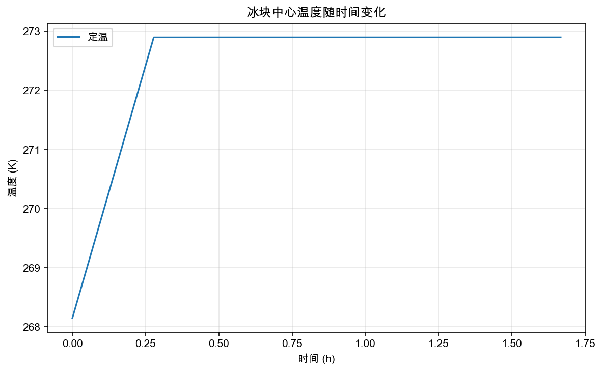

Case 1 最终温度分布：

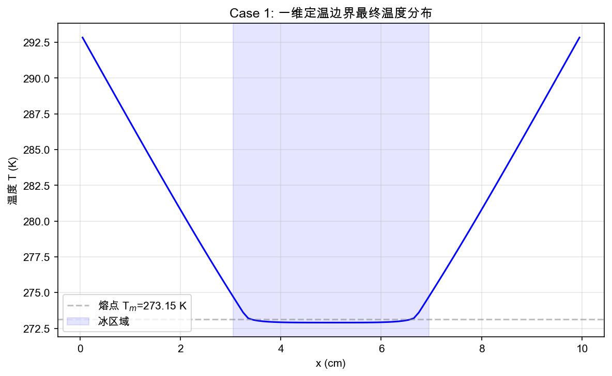

Case 2 冰块中心温度随时间变化：


Case 2 最终温度分布：

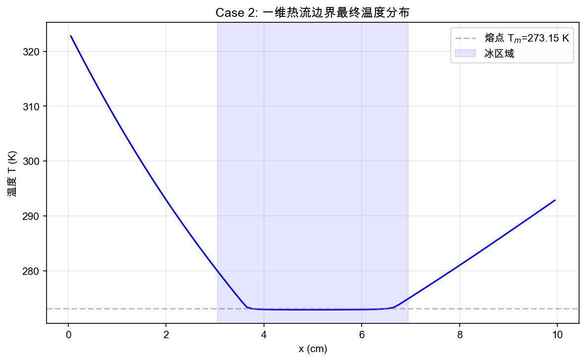

Case 3 冰块中心温度随时间变化：


Case 3 最终温度分布：

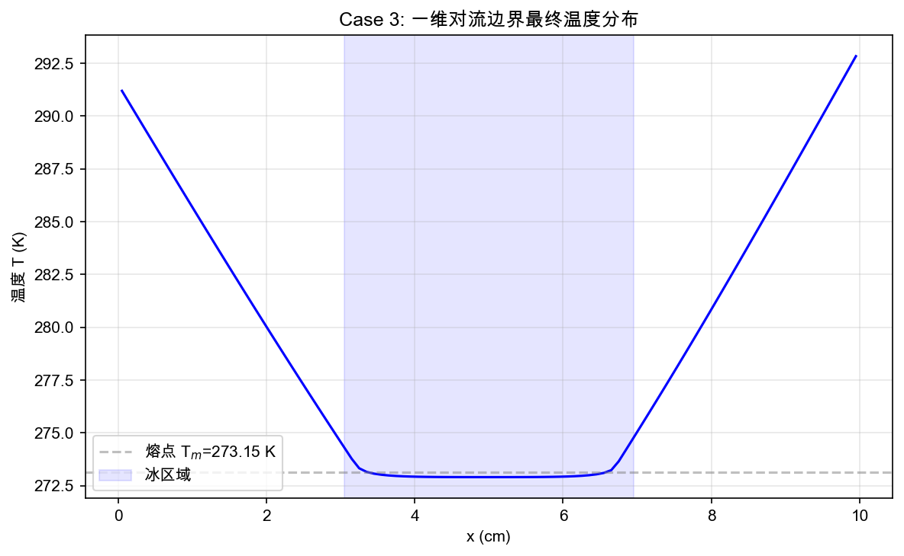

### 二维算例

Case 4 温度场云图：

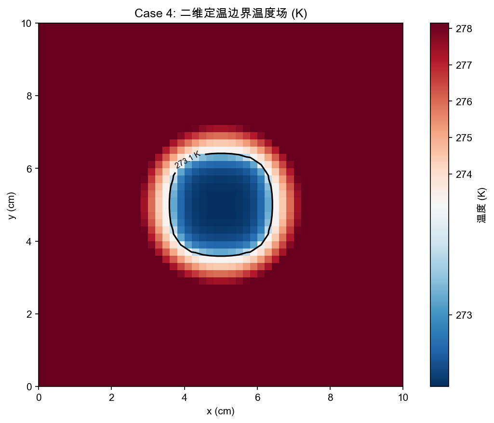


Case 4 液相率分布：

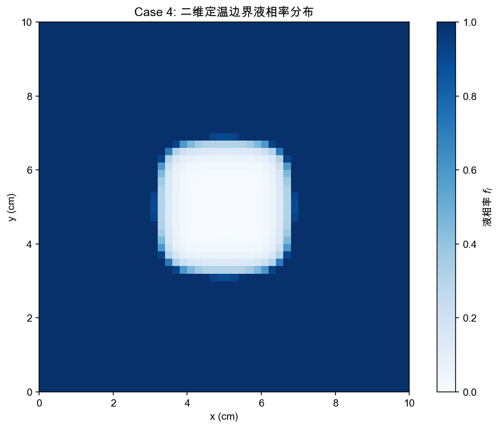

Case 5 温度场云图：

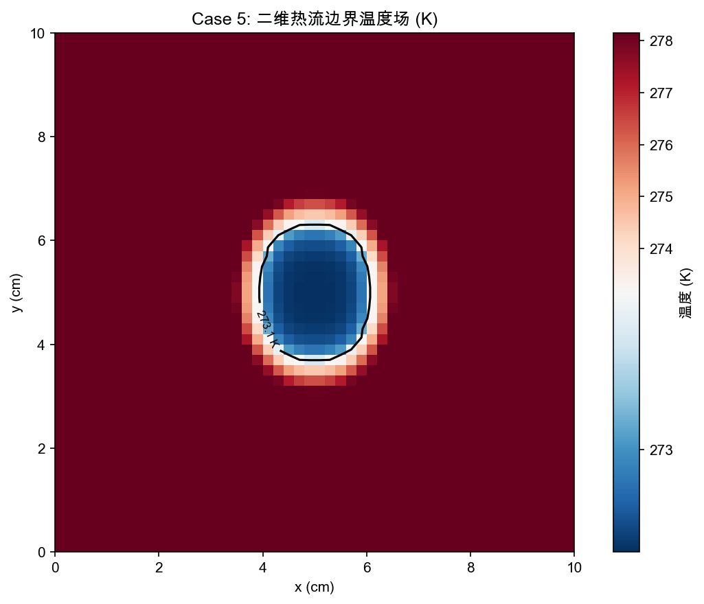

Case 5 液相率分布：

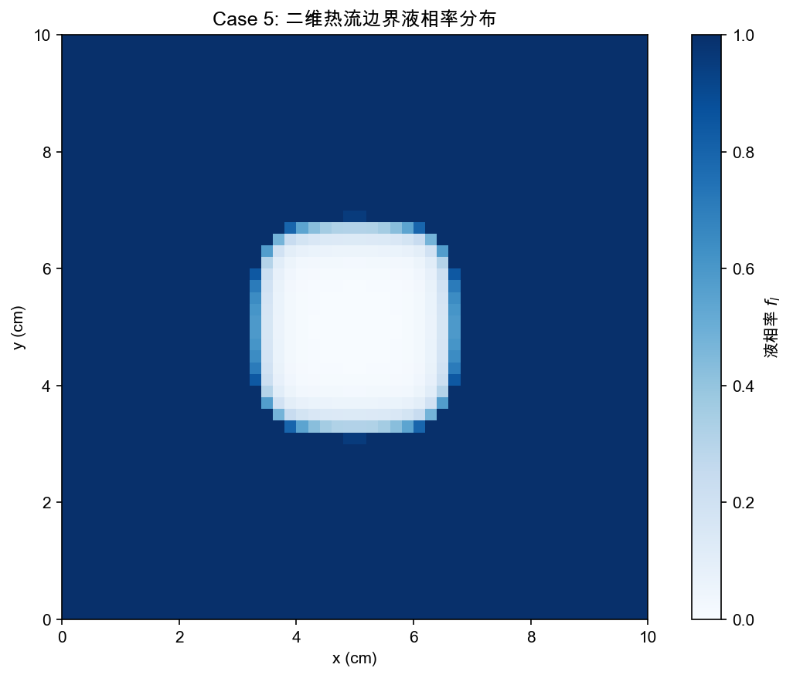

Case 6 温度场云图：


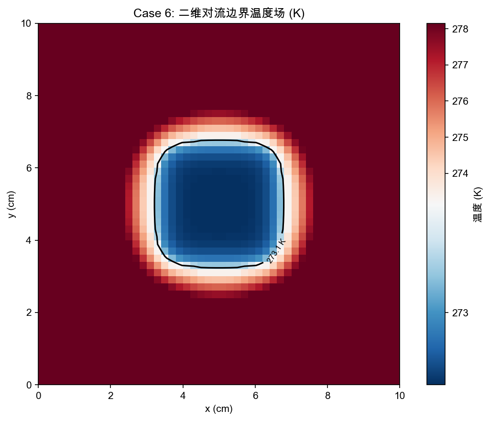

Case 6 液相率分布：

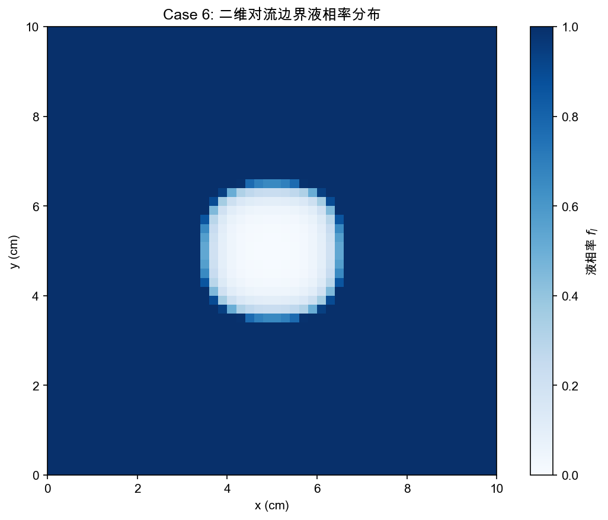

---

## 运行方式

```bash
python main.py
```

运行约 10 分钟，结果保存在 `output/` 目录（PNG 图片 + .npz 数据文件）。

### 环境依赖

- Python 3.10+
- NumPy, SciPy, Matplotlib

---

## 物理参数

| 参数 | 符号 | 数值 | 单位 |
|------|------|------|------|
| 水密度 |  | 999.8 | kg/m³ |
| 水导热系数 |  | 0.569 | W/(m·K) |
| 水比热容 |  | 4217 | J/(kg·K) |
| 冰密度 |  | 917.0 | kg/m³ |
| 冰导热系数 |  | 2.25 | W/(m·K) |
| 冰比热容 |  | 2090 | J/(kg·K) |
| 熔点 |  | 273.15 | K |
| 相变区间半宽 |  | 0.25 | K |
| 相变潜热 |  | 334000 | J/kg |
